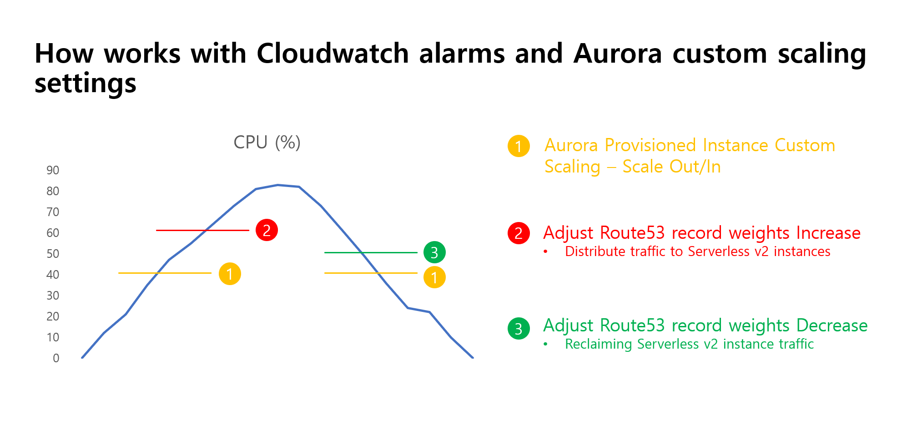

# Guidance for Handling Data during Traffic Spikes on AWS

## Table of Contents

1. [Overview](#overview)
    - [Cost](#cost)
2. [Prerequisites](#prerequisites)
    - [Operating System](#operating-system)
3. [Deployment Steps](#deployment-steps)
4. [Deployment Validation](#deployment-validation)
5. [Running the Guidance](#running-the-guidance)
6. [Next Steps](#next-steps)
7. [Cleanup](#cleanup)

## Overview

Businesses often experience unexpected traffic spikes due to marketing events, new product launches, and more. During such periods, a rapid increase in database load can lead to query delays, connection limit exhaustion, transaction failures, and ultimately, service degradation and outages, which can severely impact a company's credibility and revenue.

Amazon Aurora database auto-scaling provisions additional instances during load surges, but the provisioning process takes time, making it challenging to respond in real-time to sudden traffic changes. Moreover, accurate traffic forecasting is difficult, often resulting in unnecessary over-provisioning.

To address these challenges, this guide introduces an Amazon Aurora Mixed-Configuration Cluster architecture that combines a provisioned Amazon Aurora cluster with Aurora Serverless v2 (ASV2) instances, along with a custom auto-scaling solution based on high-resolution metrics. During normal operations, traffic is served by the provisioned cluster. When load surges, some (or all) traffic is automatically routed to ASV2 instances. Simultaneously, additional read replicas are automatically added to the provisioned cluster to handle prolonged traffic spikes. As the load decreases, only the minimum required ASV2 capacity is maintained, minimizing costs. Furthermore, ASV2 instances can be utilized for various purposes like analytics, batch jobs, etc., offloading workloads from the operational service.

This architecture enables a real-time response to unpredictable traffic fluctuations, preventing database overload and ensuring service continuity. Dynamic resource allocation prevents database overload, service disruptions, and unnecessary over-provisioning, thereby optimizing cost-efficiency.

## Architecture


The Amazon Aurora Mixed-Configuration Cluster with Custom Auto Scaling system architecture proposed in this guide consists of the following key steps:

1. **Configure Amazon Aurora Mixed-Configuration Cluster**
   - Add Aurora Serverless v2 (ASV2) read-replica instances to an existing provisioned Amazon Aurora cluster
   - Configure custom endpoints
   - Enable Amazon RDS Enhanced Monitoring

2. **Configure Amazon Route 53 Weighted Record Set**
   - Set up a Private Hosted Zone
   - Create weighted record sets for custom endpoints

3. **Use Amazon CloudWatch Logs Subscription Filter and AWS Lambda**
   - Extract CPU utilization metrics from provisioned read-replica instances

4. **Create Real-time Custom Metrics using Embedded Metric Format**

5. **Set Amazon CloudWatch Alarms on Custom Metrics**

6. **Trigger AWS Step Functions on Alarm**
   - Adjust Amazon Route 53 record weights and continuously monitor
   - Set ASV2 endpoint weight to 0 to block traffic during low load
   - Dynamically adjust ASV2 weights as needed

7. **Configure Aurora Custom Auto Scaling**
   - Use AWS Auto Scaling APIs to auto-scale the Amazon Aurora cluster
   - On scale-out: Add provisioned read replicas
   - On scale-in: Remove provisioned read replicas

## Cost

You will need to pay for the AWS services used while running this guidance.

For cost management, we recommend creating a budget through AWS Cost Explorer. Prices are subject to change. For more details, refer to the pricing pages for each AWS service used in this guidance.

1. **AWS Lambda**
    - Memory allocation: 128MB
    - Price: $0.20 per 1 million requests (Seoul region)

2. **Amazon Aurora Serverless v2**
    - ACU price: $0.20/hour for an average usage of 1 ACU (Seoul region)
    <!-- 
    - Price during spike periods with a maximum of 64 ACUs: 0.20(1 ACU) * 64 = $12.8/hour (Seoul region)
    - Monthly cost during normal periods: $0.2 * 730 hours = $146.00
    - Monthly cost during spike periods: $12.8 * 96 (4days) = $1,228.8 (assuming spike periods occur once a week for 24 hours) 
    -->

3. **Amazon CloudWatch Logs**
    - Price: $1.53/GB (Seoul region)
    - Assumption: 1GB/month of log data generated

4. **Amazon Route 53**
    - Weighted routing policy
    - Price: $0.90 per 1 million queries (Seoul region)

**Total monthly estimated cost for all services**<br>
The following table provides a sample cost breakdown for deploying this Guidance with the default parameters in the Asia Pacific (Seoul) Region for one month.

| AWS service  | Dimensions | Cost [USD] |
| ----------- | ------------ | ------------ |
| AWS Lambda | Monthly 2,592,000 executions | $1.60/month |
| Amazon Aurora Serverless v2 | Monthly during normal periods: 730 hours (1 ACUs) | $146.0/month |
| Amazon CloudWatch Logs | 1GB/month of log data generated | $1.53/month |
| Amazon Route 53 | 1 million queries | $0.90/month |

<!--| Amazon Aurora Serverless v2 | Monthly during spike periods: 96 hours (64 ACUs) | $1,228.8/month |-->
- Total: $1.60 + $146.0 + $1.53 + $0.90 = $150.03/month
<!-- - Total: $1.60 + $146.0(normal) + $1,228.8(spike) + $1.53 + $0.90 = $1,378.83/month -->

Note: **This amount is an estimate and does not include the cost of provisioned instances**. The actual cost may vary depending on your usage and provisioned services.

## Prerequisites

### Operating System

These deployment instructions are optimized to best work on <Amazon Linux 2/Amazon Linux 2023 AMI>. Deployment in another OS may require additional steps.

1. Ensure that `AWSCloudFormationStackSetAdministrationRole` role, and `AWSCloudFormationStackSetExecutionRole` role are created in the primary region where the Amazon Aurora database cluster resides. For more information, see [Grant self-managed permissions](https://docs.aws.amazon.com/AWSCloudFormation/latest/UserGuide/stacksets-prereqs-self-managed.html).

2. Install and configure the latest version of the [AWS CLI (2.2.37 or newer)](https://aws.amazon.com/cli/) on the machine you are going to use to interact with the solution. This can be your personal laptop, an EC2 instance, Cloud9, or a similar machine. Set up the AWS credentials for the user who is authenticated to set up the stacks in the Primary region.

    The following packages and modules are required:

    - AWS CLI (version 2.2.37 or newer)
    - jq

    To install the required packages on Amazon Linux 2, run the following commands:

    ```bash
    # Update package lists
    sudo yum update -y

    # Install AWS CLI
    sudo yum install -y awscli

    # Install jq
    sudo yum install -y jq
    ```

    After installing the required packages, you need to configure the AWS CLI with your AWS credentials. You can do this by running the following command and following the prompts:

    ```
    aws configure
    ```

## Deployment Steps


#### 1. Clone the repository

```
git clone https://github.com/aws-solutions-library-samples/guidance-for-handling-data-during-traffic-spikes-on-aws.git
cd ./guidance-for-handling-data-during-traffic-spikes-on-aws
```

#### 2. Create the AWS CloudFormation stacks in the Primary Region A
This guidance utilizes the `AdministratorAccess` role for deployment. For use in a production environment, refer to the [security best practices](https://docs.aws.amazon.com/IAM/latest/UserGuide/best-practices.html) in the AWS Identity and Access Management (IAM) documentation and modify the IAM roles, Amazon Aurora, and other services used as needed.

* Using the AWS Management Console

    * Sign in to the AWS CloudFormation console
    * Create Stack > Upload the `./source/templates/Amcc-Stack.yaml` file
    * Deploy the stack after entering `Amcc-Stack` in the stack name
        * The parameters can be changed, but we recommend the default values for a smooth deployment.

* Using Script
    ```
    source ./deployment/deploy.sh
    ```

## Deployment Validation

Open the AWS CloudFormation console and verify the status of the template with the name starting with `Amcc-Stack`.

Deploying this stack automatically configures the following environments:

- **VPC, subnet, internet gateway, NAT gateway:** A VPC with public and private subnets, an internet gateway for public access, and a NAT gateway for internet access for private instances.

- **Amazon Aurora Mixed-Configuration MySQL cluster:** An Amazon Aurora MySQL cluster consisting of a provisioned writer instance, a provisioned reader instance, and an Aurora Serverless v2 instance.

- **Aurora custom endpoints:** Custom endpoints for the provisioned reader and serverless reader instances.

- **Amazon Route 53 Private Hosted Zones:** A private hosted zone with weight-based records for traffic balancing.

- **AWS Lambda functions:** Lambda functions for collecting custom Amazon CloudWatch metrics, increasing and decreasing Amazon Route 53 weights, and creating custom scaling policies.

- **AWS Step Functions:** Step Functions for traffic balancing and reclaiming based on Amazon CloudWatch alerts.

- **Amazon CloudWatch alerts and Amazon EventBridge rules:** Amazon CloudWatch alerts to monitor CPU usage and Amazon EventBridge rules to trigger the AWS Step Functions state machine.

- **You can see the detailed output in the AWS CloudFormation `Amcc-Stack` stack Resources.**

    ```
    aws cloudformation describe-stacks --stack-name amcc-guidance --query 'Stacks[0].Outputs' --output table --no-cli-pager
    ```

## Running the Guidance

#### The deployed guidelines work with the CPU criteria shown in the figure below.



If you're using a separate load testing tool, you can generate **read traffic** load on the `read.amcc-rds.com` endpoint. If your Java application uses a connection pool, we recommend using the latest [AWS JDBC driver for MySQL](https://docs.aws.amazon.com/AmazonRDS/latest/AuroraUserGuide/Aurora.Connecting.html#Aurora.Connecting.JDBCDriverMySQL). This driver can be used as a drop-in replacement for the MySQL Connector/J driver. It has a built-in mechanism that ensures the cluster endpoint always maps to the writer instance in the cluster.

To allow your Java application to quickly remap traffic during sudden spikes of load, you can adjust the [DNS TTL (Time to Live)](https://docs.aws.amazon.com/AmazonRDS/latest/AuroraUserGuide/Aurora.BestPractices.html) setting. To set the DNS TTL globally for all Java apps running on the host, you can edit the `$JAVA_HOME/jre/lib/security/java.security` file and set the following property:
```
networkaddress.cache.ttl=0
```
You can also set the DNS TTL in your Java code:
```
java.security.Security.setProperty("networkaddress.cache.ttl", "0")
```
#### **Since this guidance does not include a load testing tool, we will proceed by adjusting the alarm thresholds.**

#### 1. Adjusting Traffic Distribution Alarm

The logic for traffic distribution based on Amazon CloudWatch custom metrics works as follows: <br>
Traffic Distribution Alarm (Default Threshold: 60%) -> Amazon EventBridge -> Invokes AWS Step Functions (runs AWS Lambda) -> Increases Amazon Route 53 serverless record weights

- To experiment, access the AWS console and navigate to the Amazon CloudWatch service's alarms.
- Edit the `TrafficReclaimAlarmsArn` and adjust the Threshold value to 10.
- After a short while (10 seconds), an alert will be triggered, and Amazon EventBridge will invoke AWS Step Functions.
- As AWS Step Functions execute, the weight starts with an `incresing of 4 every 30 seconds` and finally `increases to 20 (MAX_WEIGHT)`.

#### 2. Adjusting Traffic Reclaim Alarm
The logic for traffic distribution based on Amazon CloudWatch custom metrics works as follows:<br>
Traffic Reclaim Alarm (Default Threshold: 50%) -> Amazon EventBridge -> Invokes AWS Step Functions (runs AWS Lambda) -> Adjusts Amazon Route 53 record weights

- To experiment, access the AWS console and navigate to the Amazon CloudWatch service's alarms.
- Edit the `TrafficReclaimAlarmsArn` and adjust the Threshold value to 10.
- After a short while (10 seconds) the alarm changes to normal.
- Again, adjust the alarm's Threshold value to 50. after a short while (10 seconds) an alert will be triggered, and Amazon EventBridge will invoke AWS Step Functions.
- As AWS Step Functions execute, the weight starts `decreasing by 4 every 60 seconds` and finally `decreases to 0 (MIN_WEIGHT)`.

#### 3. Adjusting Custom Auto Scaling for Provisioned Instance Scaling
- Custom auto scaling cannot be controlled from the console. Therefore, you can modify it through the deployed AWS Lambda function or AWS Lambda function code using the CLI.
- Navigate to the `Control-AuroraCustomScaling` Lambda function and adjust the `TARGET_VALUE` (default 40) to 10 in the `Environment Variables` value.
- After approximately 3 minutes, you will be able to observe an increase in provisioned instances.

## Next Steps
> **The infrastructure and services set up in this guide are intended for learning purposes and are not designed for production environments. You should carefully review and modify the configurations to meet the requirements of your production workloads before deploying to a production environment.**

You can customize the following values:

| AWS Service | Resource Name | Description | Default Value |
| ----------- | ------------- | ----------- | ------------- |
| Amazon CloudWatch Alarms | `traffic-distribution-alarm` | Alarm criteria for distributing traffic to Aurora Serverless v2 instances by adjusting Amazon Route 53 weights | `Threshold`: 60% |
| Amazon CloudWatch Alarms | `traffic-reclaim-alarm` | Alarm criteria for reclaiming traffic from Aurora Serverless v2 instances by adjusting Amazon Route 53 weights | `Threshold`: 50% |
| AWS Lambda | `IncreaseRoute53Weights` | Criteria for adjusting Amazon Route 53 serverless record weights (refer to environment variables) | `MIN_WEIGHT`: 0 <br> `MAX_WEIGHT`: 20 <br> `STEP_SIZE`: 4 |
| AWS Lambda | `DecreaseRoute53Weights` | Criteria for adjusting Amazon Route 53 serverless record weights (refer to environment variables) | `MIN_WEIGHT`: 0 <br> `MAX_WEIGHT`: 20 <br> `STEP_SIZE`: 4 |
| AWS Step Functions | `SF-TrafficDistribution` | `DecreaseRoute53Weights` AWS Lambda Function Orchestration  | `"Waiting Reflection"."Seconds"`: 30 |
| AWS Step Functions | `SF-TrafficReclaim` | `IncreaseRoute53Weights` AWS Lambda Function Orchestration  | `"Waiting Reflection"."Seconds"`: 60 |
| AWS Lambda | `Control-AuroraCustomScaling` | Aurora Custom Auto Scaling criteria for scaling provisioned instances (refer to environment variables) | `TARGET_VALUE`: 40% |
|Amazon Route 53 |`read.amcc-rds.com` <br> `PROVISIONED_RO_RECORD_IDENTIFIER`| Weights of the provisioned read instances | `Weight`: 10 |

Rather than providing step-by-step instructions, it is recommended to explore and experiment with these configurations to gain a better understanding and determine the optimal settings for your specific use case.

## Cleanup
If you no longer need it, you can delete the AWS CloudFormation stack to clean up resources.

* If you deployed using the CloudFormation console:

    1. Delete the Auto Scaling Provisioned instances in Aurora Cluster created by the AWS Auto Scaling.
    2. Delete the weight-based records in Route53 created by the CloudFormation stack.
    3. Deleting the S3 bucket created by the CloudFormation stack
    4. Now, You can delete the deployed CloudFormation stack. 

* If you deployed using the provided script:
    ```
    source ./deployment/clean.sh
    ```

## More information
Related blog: [How ktown4u built a custom auto scaling architecture using an Amazon Aurora mixed-configuration cluster to respond to sudden traffic spikes](https://aws.amazon.com/ko/blogs/database/how-ktown4u-built-a-custom-auto-scaling-architecture-using-an-amazon-aurora-mixed-configuration-cluster-to-respond-to-sudden-traffic-spikes/)

## License

This library is licensed under the MIT-0 License. See the LICENSE file.